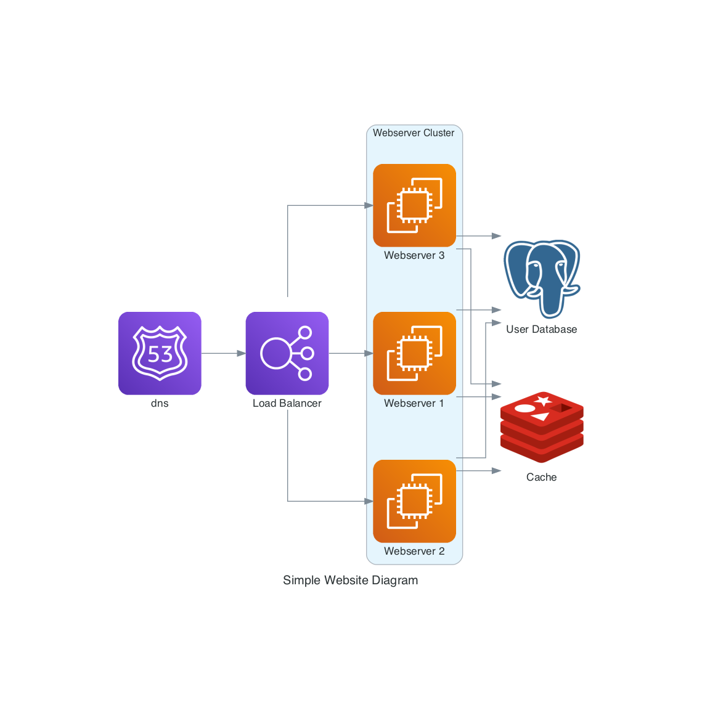
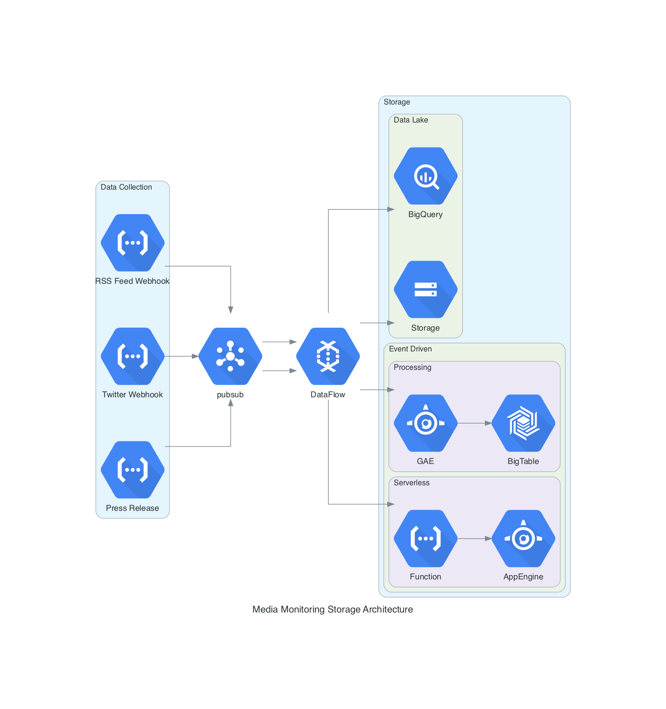

# trace-iac-sample-architecture-diagrams

### Create Beautiful Architecture Diagrams with Python

Stop spending time manually tweaking misaligned arrows

Example1 
Example2 

# I included some sample diagrams as code for your reference

## Getting Started With Your Own Diagrams
The first requirement to get started with building some of these diagrams is having Python 3.6 or higher installed. Once this is the case you will need to install GraphViz as this is what renders the diagrams. The Github repository actually has a pretty decent “Getting Started” section as well so if you need help installing anything feel free to refer to that [here](https://github.com/mingrammer/diagrams#getting-started). Which once you have installed the library “diagrams” with your favorite Python package manager you are ready to start creating.

## Component Types

The diagraming library provides components for a number of different providers. The following will likely be most relevant for most use cases out of the 14 available.

 *  AWS/GCP/Azure — These providers expose the official cloud service assets that you would be using for any diagram that leverages one of the main cloud providers. My team mostly works in GCP, and I would spend hours building these diagrams manually before stumbling across this library so I was a bit excited when I discovered I had these node assets at my fingertips.

* Generic and On-Premise — These nodes will likely be used together in the case that you want to illustrate the underlying technologies in a cloud agnostic way. For example supplying an architecture with a Beam component over display Google DataFlow.

* Frameworks — These components will be useful if you want to illustrate a node with a programming language.

* SaaS — There is even a collection of SaaS nodes that one can use which comes in handy when you want to show that your architecture has notifications landing in something such as Slack.

## use  Diagrams librabry to create your beautiful cloud provider architectures as code
#  [More Diagrams UML documentation here at](https://diagrams.mingrammer.com/)
